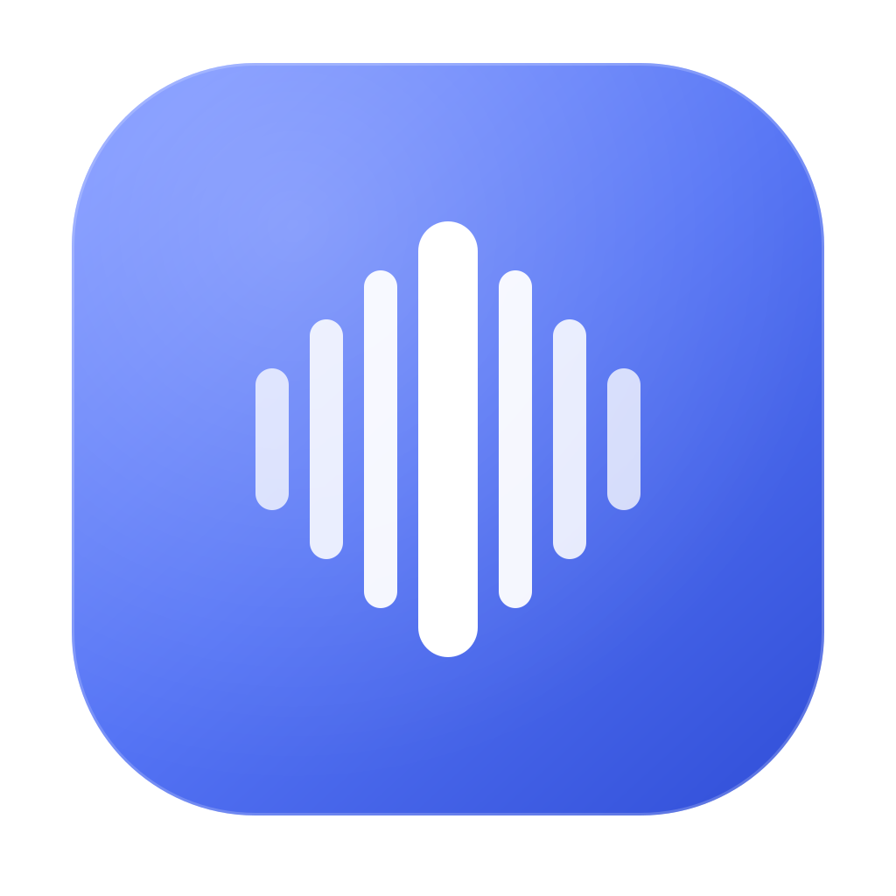
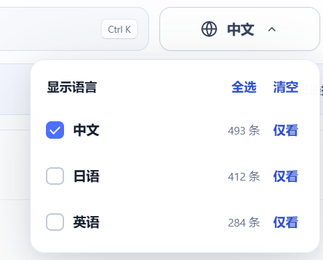
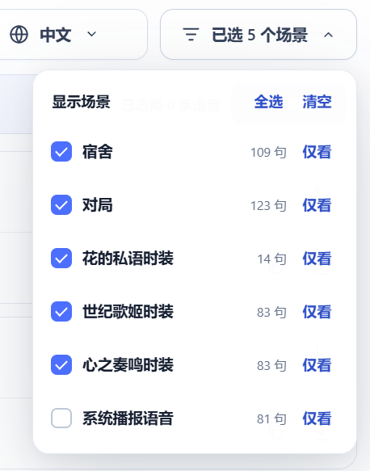
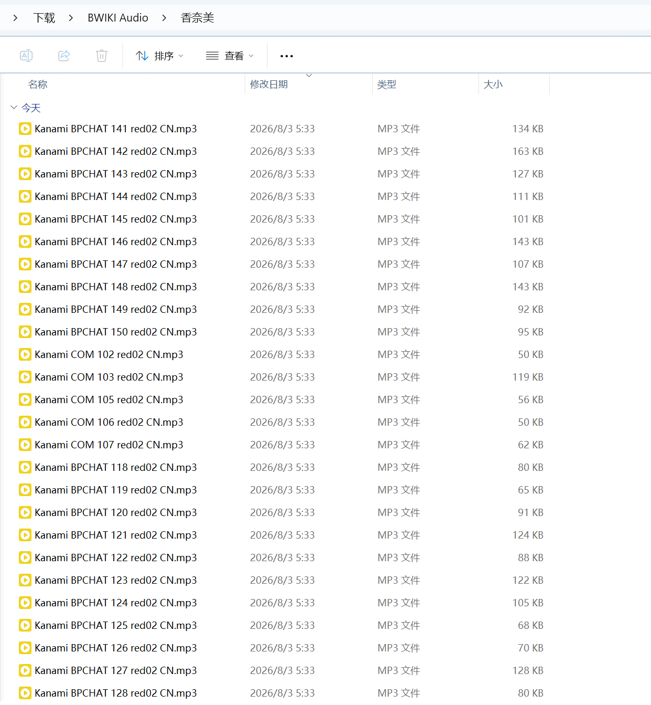

<p align="center">
  
</p>

<h1 align="center">拾音 Shiyin</h1>

<p align="center">
  <strong>把喜欢的角色语音，轻松收进本地。</strong><br>
  一款使用 Go 与 Wails 编写的跨平台 BWIKI 语音提取、筛选与批量下载工具。
</p>

<p align="center">
  <a href="https://github.com/EricHongXDD/shiyin-bwiki/releases"></a>
  <a href="https://github.com/EricHongXDD/shiyin-bwiki/actions/workflows/ci.yml"></a>
  
  
  <a href="LICENSE"></a>
</p>

> [!IMPORTANT]
> 拾音是社区开源项目，与哔哩哔哩、Bilibili Game、BWIKI 及相关游戏厂商没有隶属或官方合作关系。请仅下载和使用你有权保存的内容，并遵守页面、游戏和音频素材的版权要求。

## 它能做什么

给拾音一个 BWIKI 角色语音页面 URL，它会解析页面中的实际音频地址，把同一句台词的中文、日语、英语等配音聚合展示。你可以搜索台词，组合筛选语言和场景，试听后单条或批量选择，并交给可恢复的并发下载队列。

示例地址：

```text
https://wiki.biligame.com/klbq/米雪儿·李/语音台词
```

### 核心功能

- **多语言解析**：识别同一句台词的多个语言版本，并显示语言统计。
- **语言多选**：全选、清空、组合勾选或“仅看”某一种语言。
- **场景多选**：按宿舍、对局、服装语音等页面章节组合筛选。
- **本地模糊搜索**：匹配标题、章节、台词正文、语言和文件名。
- **灵活选择**：支持整句、单个语言变体、当前结果全选和一键下载本句。
- **批次任务**：每次下载汇总为一个批次，避免数百条任务挤满面板。
- **任务明细**：点击批次查看语音详情；超过 20 条自动分页。
- **完整状态筛选**：排队中、下载中、已暂停、已完成、下载失败、已取消均可筛选。
- **并发与断点续传**：多任务并发，使用 `.part`、HTTP Range、ETag 和 Last-Modified 恢复中断下载。
- **可恢复历史**：应用重启后恢复批次、进度、错误原因和断点状态。
- **结构化错误**：区分 URL、域名、网络、HTTP、MediaWiki API、页面结构和未发现音频等问题。
- **安全边界**：只接受可信 BWIKI/Bilibili 音频域，并阻断本机、私网、链路本地和云元数据地址。

## 界面预览

### 语言与场景筛选

<table>
  <tr>
    <td width="50%" align="center"></td>
    <td width="50%" align="center"></td>
  </tr>
  <tr>
    <td align="center">按语言组合筛选</td>
    <td align="center">按页面章节与场景组合筛选</td>
  </tr>
</table>

### 下载结果

<p align="center">
  
  <br><sub>截图来自更名前的早期版本；新版默认下载目录已更名为 Shiyin。</sub>
</p>

## 下载

前往 [Releases](https://github.com/EricHongXDD/shiyin-bwiki/releases) 下载对应平台的压缩包：

| 平台 | Release 产物 | 说明 |
| --- | --- | --- |
| Windows x64 | `Shiyin-vX.Y.Z-windows-amd64.zip` | 解压后运行 `Shiyin.exe`；需要 WebView2 Runtime |
| macOS 通用版 | `Shiyin-vX.Y.Z-macos-universal.zip` | 同时包含 Intel 与 Apple Silicon 架构 |
| Linux x64 | `Shiyin-vX.Y.Z-linux-amd64.tar.gz` | 需要 GTK3、WebKit2GTK 4.1；音频试听还需要 GStreamer 插件 |
| 校验和 | `SHA256SUMS.txt` | 用于验证下载文件是否完整 |

当前自动构建产物尚未进行商业代码签名：Windows 可能显示 SmartScreen 提醒，macOS 可能显示 Gatekeeper 提示。请从本项目 Release 页面下载，并根据校验和验证文件。

## 快速使用

1. 启动拾音，粘贴一个 `wiki.biligame.com` 的角色语音页面 URL。
2. 点击“解析页面”，等待语言、场景和语音列表出现。
3. 使用搜索框、语言下拉框和场景下拉框缩小范围。
4. 勾选整句或某个语言版本；隐藏在筛选外的选择会继续保留并明确计数。
5. 选择保存目录，点击“下载所选”。
6. 在右侧查看批次汇总；点击批次可分页查看明细、筛选状态或操作单条任务。

## 下载任务与断点续传

拾音默认同时下载 4 个任务。下载中的数据写入同目录下的 `.part` 文件，并保存远端 ETag、Last-Modified 和已下载字节数。暂停、程序退出或网络中断后，重新开始任务时会优先发出 HTTP Range 请求；若服务器资源已经改变，下载器会安全地从头开始，避免拼接出损坏文件。

任务状态保存在系统配置目录：

| 系统 | 默认位置 |
| --- | --- |
| Windows | `%AppData%\Shiyin\tasks.json` |
| macOS | `~/Library/Application Support/Shiyin/tasks.json` |
| Linux | `$XDG_CONFIG_HOME/Shiyin/tasks.json` 或 `~/.config/Shiyin/tasks.json` |

从旧版升级时，如果检测到原来的 `BWIKIAudio` 状态目录，应用会继续读取它，不会丢失历史任务和断点数据。

## 关于音频格式

拾音不会转码，会原样保存 BWIKI 返回的字节和页面提供的文件名。部分站点资源虽然使用 `.mp3` 文件名且响应为 `audio/mpeg`，实际文件头却可能是 WAV/PCM；因此会出现“扩展名是 `.mp3`，内容实际是 WAV”的情况。示例页实测同时包含真正的 MP3 和这类 WAV/PCM 资源。这来自上游资源命名，下载器不会擅自改变原音频。

解析器目前识别 `.mp3`、`.wav`、`.ogg`、`.m4a`、`.aac`、`.flac`、`.opus` 和 `.webm` 等常见音频地址。

## 从源码构建

### 通用要求

- Go 1.23 或更高版本
- Wails CLI 2.11.0
- 对应平台的原生 WebView 开发依赖

安装锁定版本的 Wails CLI：

```bash
go install github.com/wailsapp/wails/v2/cmd/wails@v2.11.0
```

前端是已经构建好的原生 HTML/CSS/JavaScript，不需要 Node.js 或 npm。

### Windows

安装 [WebView2 Runtime](https://developer.microsoft.com/microsoft-edge/webview2/)，然后运行：

```powershell
wails build -clean -trimpath -platform windows/amd64
```

### macOS

安装 Xcode Command Line Tools，然后运行：

```bash
wails build -clean -trimpath -platform darwin/universal
```

### Ubuntu / Debian Linux

```bash
sudo apt-get update
sudo apt-get install -y build-essential pkg-config libgtk-3-dev libwebkit2gtk-4.1-dev
wails build -clean -trimpath -platform linux/amd64 -tags webkit2_41
```

若要在 Linux 中试听音频，通常还需安装：

```bash
sudo apt-get install -y gstreamer1.0-plugins-good
```

## 开发与测试

```bash
go test ./...
go vet ./...
```

在 Ubuntu 24.04 上使用 WebKit2GTK 4.1 标签：

```bash
go test -tags webkit2_41 ./...
go vet -tags webkit2_41 ./...
```

发布前可选择运行真实页面和 CDN 网络策略验证：

```bash
BWIKI_LIVE_TEST=1 go test ./internal/bwiki ./internal/download -run TestLive
```

真实页面测试会访问 BWIKI，常规测试默认跳过网络请求。

如需额外核对中、日、英样本的响应头和真实文件头：

```bash
BWIKI_LIVE_TEST=1 BWIKI_FORMAT_AUDIT=1 go test ./internal/bwiki -run TestLiveSamplePage -v
```

## 自动化发布

项目包含两套 GitHub Actions：

- [`CI`](.github/workflows/ci.yml)：在推送和 Pull Request 时检查格式、前端语法、`go vet`、竞态测试、图标可重复生成和版本准备工具。
- [`Release`](.github/workflows/release.yml)：可以手动触发三平台“只构建”验证，并汇总检查压缩包与 SHA-256；推送 `vX.Y.Z` 标签后，则会在原生 Windows、macOS、Linux Runner 上分别构建和验证，自动创建或更新 GitHub Release。

创建发布版本：

```bash
git tag v1.0.0
git push origin v1.0.0
```

只有三个平台全部构建成功后，Release 才会发布。

## 项目结构

```text
.
├─ app.go                     前后端服务桥接与稳定 DTO
├─ main.go                    Wails 窗口、平台选项和资源入口
├─ internal/
│  ├─ bwiki/                  URL 校验、页面获取、多语言与场景解析
│  └─ download/               并发队列、批次、断点续传与持久化
├─ frontend/dist/             无运行时依赖的桌面界面
├─ assets/brand/              SVG 品牌图标源文件
├─ build/                     Wails 图标与平台元数据
├─ packaging/linux/           Linux 桌面入口
├─ tools/                     图标与发布版本生成工具
└─ .github/workflows/         CI 与三平台自动发布
```

## 常见问题

### 为什么解析时提示 HTTP 567？

这通常表示请求被 BWIKI 的 EdgeOne 安全策略拦截。稍后重试、更换网络，或先在浏览器确认页面可以正常访问。

### 为什么某些语言没有出现？

页面本身可能缺少该语言，也可能使用了解析器尚未识别的页面结构。拾音会在解析结果中给出被跳过项目和结构异常的原因。

### 为什么暂停后没有从原位置继续？

只有远端服务器支持 Range，且资源校验信息没有改变时才能安全续传。服务器不支持或文件已更新时，拾音会重新下载，避免产生损坏文件。

### 下载器会绕过登录、付费或访问控制吗？

不会。拾音只读取页面公开提供且位于可信音频域的资源，不提供绕过认证或访问控制的能力。

## 贡献

欢迎提交 Issue 和 Pull Request。提交前请确保：

- `gofmt` 没有产生额外变更；
- `go test ./...` 与 `go vet ./...` 通过；
- 涉及 UI 的变更包含可复现的验证步骤；
- 不提交未经授权的音频文件或其他受版权保护素材。

## Codex 辅助声明

本项目在产品设计、代码实现、测试、界面打磨、跨平台自动化和文档整理过程中使用了 **OpenAI Codex** 辅助完成。所有发布内容均由项目维护者审核，项目维护与发布责任由维护者承担。

## 许可证

项目源代码使用 [MIT License](LICENSE) 开源。BWIKI 页面内容、游戏名称、角色、台词与音频素材的权利仍归各自权利人所有，MIT 许可证不授予这些第三方内容的使用权。
